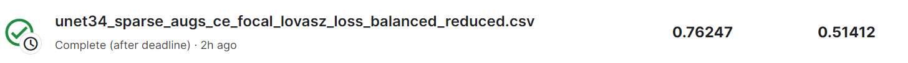
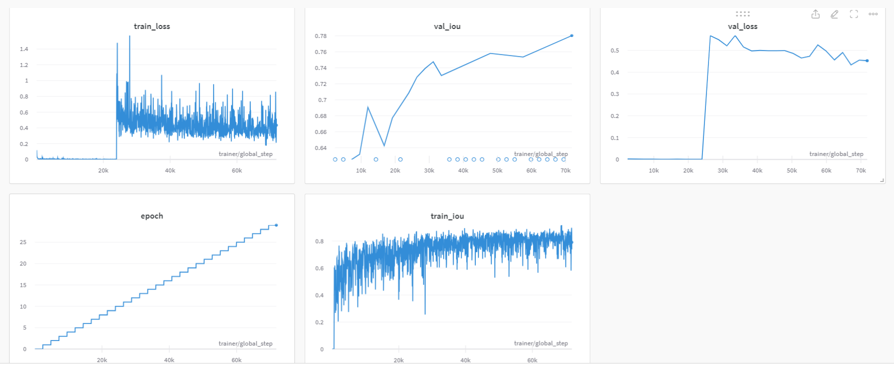

# airbus-ship-detection

Some assumptions made during the experiments may not be true and not taking them into account may positively affect the results. Though, these assumptions had to be made due to restrictions in both time & computational resources.

## Main tool stack

The task is fully completed in Python.

* Torch - DL framework
* Torch Lightning - wrapper around Torch for structuring the training & evaluation
* segmentation_models_pytorch - a collection of models, losses, and metrics for segmentation
* Hydra - config management
* Wandb - logging

## Dataset

Firstly, I noticed that the dataset is imbalanced (more images without any ships). I decided to balance the number of ships by deleting the portion of images without any ships assuming that there still will be enough data for building an accurate model.
For all of the experiments, I reduced the size of the images to 512/512. I split the labeled data into training/validation (90% for training). Also, due to the limited resources, I use only a portion of labeled data (20%) due to computational limitations.
I use augmentations for training data (though I restrict them only to affine transformations).

## Model
All experiments are performed with the U-net architecture with Resnet34 encoder. The encoder is pre-trained on Imagenet (don't know many cases where pre-training hurts).
I don't change the architecture of the model further on.

## Training

Configs:

* learning rate - 0.001
* optimizer - ADAM
* epochs - 30-50 (Firstly, in my experiments, I trained for 30 epochs, but the validation loss still could be reduced(hasn't converged fully) at the end of the training, so I decided to continue learning)
* batch_size - 32

## Experiments
For the time provided, my main focus on building the best model was to look through the loss functions (including in training epoch number variations and dataset size)

The baseline model is the U-net trained with the cross-entropy loss. 

The positive class is sparse (on average it takes up to 0.2 percent of the original image), which means that cross-entropy alone may be not efficient, as it makes pixel predictions independently and
penalizes wrong predictions equally. In addition, I noticed that the model struggles most with predicting small ships (this leads to many false negative detections). Therefore, I decided to use mixed losses for training.

CE loss + focal loss (to better distinguish hard examples) and finish with optimizing Lovasz loss (usual practice for tractable IOU optimization).

I thought that the positive class sparsity can be solved by using dice loss. I tried out different combinations of dice loss with other losses and the best option was
dice loss + focal loss (to better distinguish hard examples) and finish with optimizing Lovasz loss (usual practice for tractable IOU optimization).

Combinations of dice loss turned out to be less effective than those with cross-entropy. Further experiments with loss functions (like using weighted cross-entropy for penalizing mispredictions of positive classes more) weren't fruitful.

Here is the training log of the best-performing solution: (noting that this model was trained with 30% percent of the dataset and including more data haven't provided any improvements)

## Other observations

I noticed that training only on 20-30% of the original dataset yields the same results as training on the whole dataset in terms of the final evaluation metric. It means that model can't learn new details even when provided with more data. Possibly, the more complex estimator is able to capture more intricate details.
Dice loss was the most effective for optimizing IOU, though better IOU scores haven't transferred to the better competition evaluation metric.

## Conclusions
Though many experiments could be conducted using different model architectures, training hyperparameters, and dataset preparation, I think that the most prominent direction of improving 
the results further is to come up with some sort of effective post-processing. I think we should take into account the fact, that ground-truth segmentation masks can take only a specific form (rectangular shape).
Aligning the model's predictions with this knowledge can positively influence the results. Also, I think that this task resembles more object detection task than segmentation (though the labels are prepared as segmentation masks). Possibly, it can turn out to be useful to somehow align object detection with this problem.
In addition, I think much attention should be made to the evaluation metric that the competition selected (for me particularly, it helped to concentrate more on false negative samples, though much more analysis could be made further).

